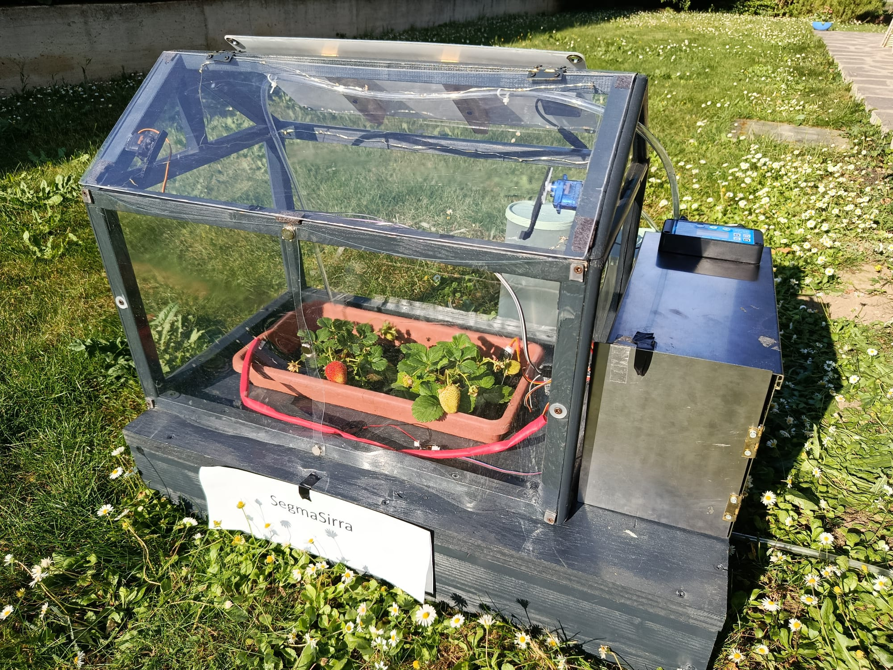
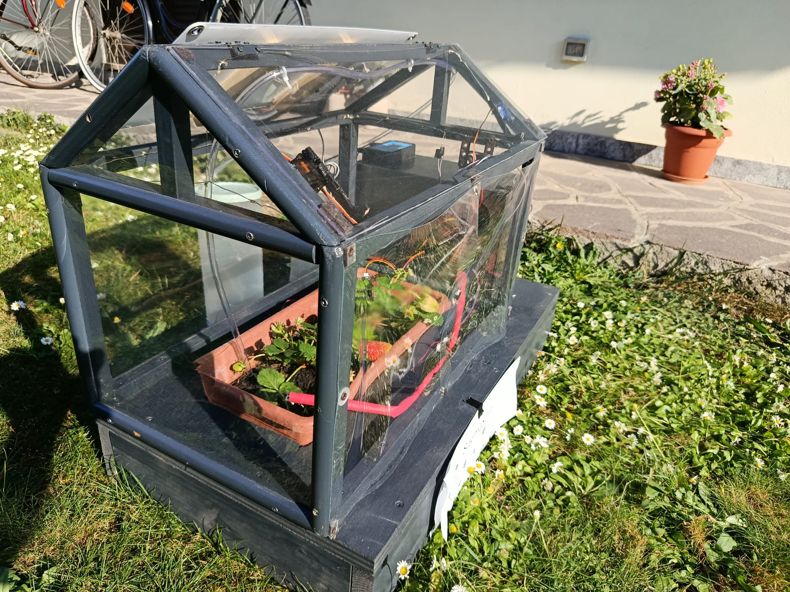
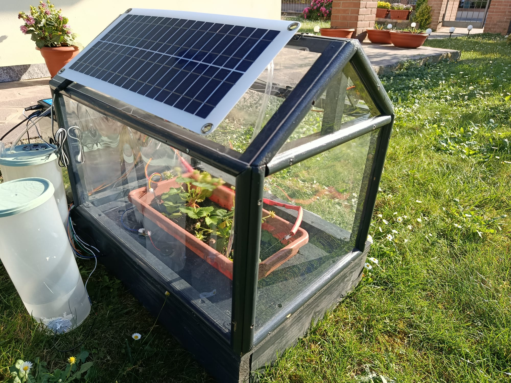
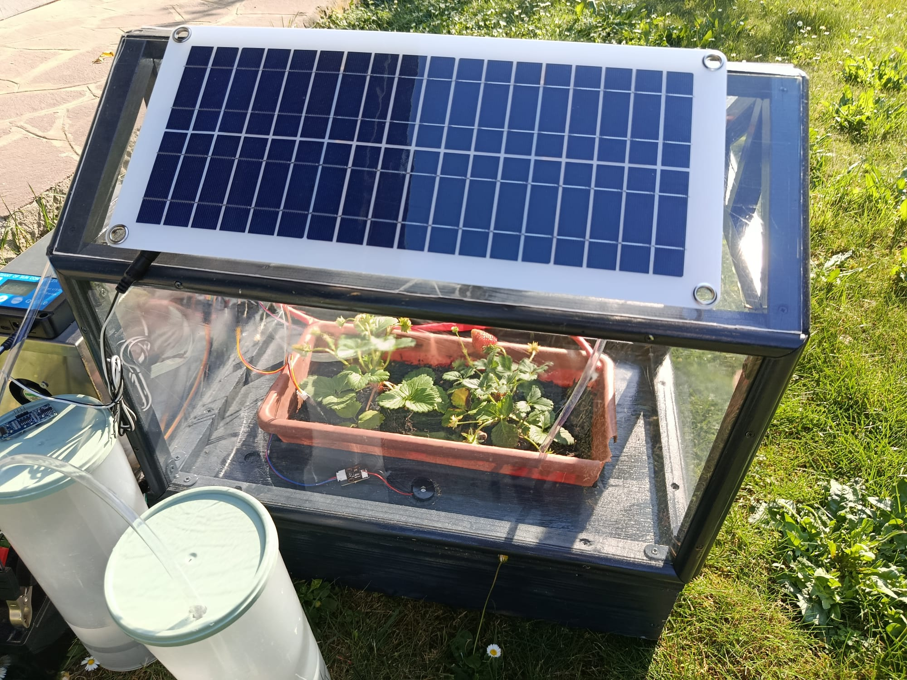

# 🌿 SegmaSirra — Smart Solar Greenhouse

<p align="center">
  <b>Un ecosistema IoT completo per la gestione, l'irrigazione e il monitoraggio remoto di una serra automatizzata e autosufficiente.</b>
</p>

<p align="center">
  
  
  
  
  
</p>

<br />

<p align="center">
  
</p>

---

## 📌 Indice
- [Cos'è SegmaSirra?](#-cosè-segmasirra)
- [📱 App Android (SegmaIpp)](#-app-android-segmaipp)
- [Galleria Fotografica](#-galleria-fotografica)
- [Architettura del Sistema](#-architettura-del-sistema)
- [Specifiche Hardware](#-specifiche-hardware)
- [Funzionalità nel Dettaglio](#-funzionalità-nel-dettaglio)
- [Struttura della Repository](#-struttura-della-repository)
- [Guida all'Installazione](#-guida-allinstallazione)
- [Licenza](#-licenza)

---

## 🍃 Cos'è SegmaSirra?

**SegmaSirra** è una serra domotica completamente **autosufficiente dal punto di vista energetico**, progettata per ottimizzare la crescita delle piante senza richiedere interventi umani continui.

Grazie al microcontrollore **ESP32-WROOM-32** e all'alimentazione integrata da pannello solare a 12V, il sistema analizza costantemente i parametri ambientali (temperatura, umidità del suolo e dell'aria, luminosità) ed esegue azioni correttive automatiche. Tutto l'ecosistema è interfacciato in tempo reale con l'applicazione Android dedicata **SegmaIpp**.

🌐 **Sito del Progetto:** [dragonyx118.github.io/SegmaSirra-Web/](https://dragonyx118.github.io/SegmaSirra-Web/)

---

## 📱 App Android (SegmaIpp)

Il controllo e il monitoraggio remoto della serra avvengono tramite un'applicazione Android sviluppata ad hoc e ospitata in una repository dedicata:

👉 **Repository dell'App:** [**Dragonyx118/SegmaIpp**](https://github.com/Dragonyx118/SegmaIpp)

### Caratteristiche dell'App:
* **Dashboard in tempo reale:** Visualizzazione dei dati di temperatura, umidità ambientale, umidità del terreno e luminosità.
* **Controllo remoto manuale:** Attivazione forzata dell'irrigazione, gestione delle luci notturne ed apertura/chiusura del tetto via Wi-Fi.
* **Notifiche ed avvisi:** Monitoraggio dello stato delle cisterne e della batteria.

---

## 📸 Galleria Fotografica

<div align="center">
  <table>
    <tr>
      <td align="center" width="50%">
        <br />
        <b>Prototipo Assemblato</b>
      </td>
      <td align="center" width="50%">
        <br />
        <b>Box Elettronica & PCB</b>
      </td>
    </tr>
    <tr>
      <td align="center" width="50%">
        <br />
        <b>Pompe & Cisterne Irrigazione</b>
      </td>
      <td align="center" width="50%">
        <br />
        <b>Meccanismo Tetto Apribile</b>
      </td>
    </tr>
  </table>
</div>

---

## ⚡ Architettura del Sistema

```text
               +----------------------------------+
               |     Pannello Solare + Reg.      |
               +-----------------+----------------+
                                 |
                                 v
                       +------------------+
                       | Batteria AGM 12V |
                       +--------+---------+
                                 |
                                 v
+--------------------------------+--------------------------------+
|                       Modulo ESP32-WROOM-32                      |
|                                                                 |
|  [Sensori Clima & Luce]  --->  Elaborazione Data  --->  [Wi-Fi] |
+-------+------------------------+------------------------+-------+
        |                        |                        |
        v                        v                        v
+---------------+        +---------------+        +---------------+
|   Attuatori   |        | Servomotori   |        |  App Android  |
| 2x Ventole    |        | Apertura      |        |   (SegmaIpp)  |
| 2x Pompe 12V  |        | Tetto         |        | Monitoraggio  |
| Luci Notturne |        +---------------+        |  & Comandi    |
+---------------+                                 +---------------+